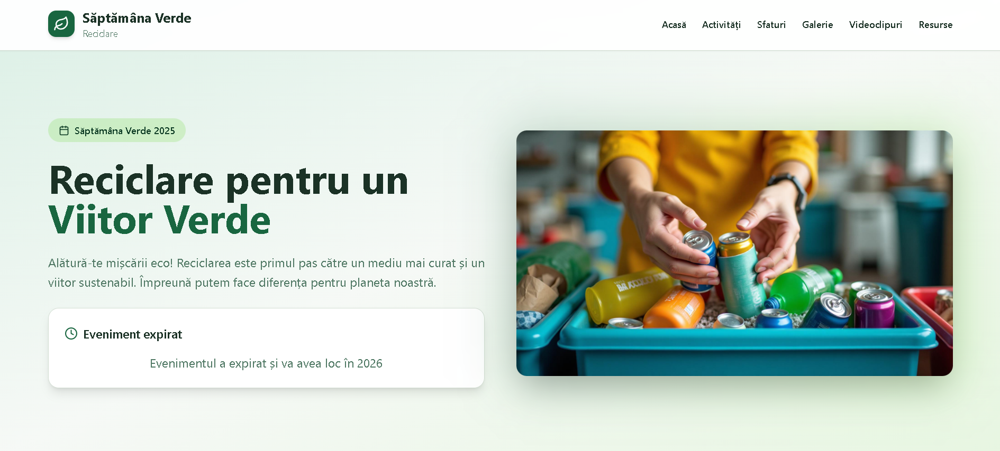

# Green Week - Săptămâna Verde



This is a modern, interactive web application dedicated to promoting environmental activities and community clean-up initiatives during Green Week. The project represents a digital initiative for raising public awareness about environmental issues, providing educational resources, information about local events, and tools for active involvement in protecting the surrounding environment.

**Live URL**: https://iam269.github.io/greenweek/

## Key Features

- 🌟 **Hero Section**: Visually appealing presentation with representative images for environmental activities
- 🧹 **Activities**: Detailed information about community clean-up events and recycling programs
- 📚 **Resources**: Guides and useful materials for recycling and waste reduction
- 💡 **Practical Tips**: Recommendations for a sustainable lifestyle
- 📸 **Photo Gallery**: Collection of images from previous events for inspiration
- 🎥 **Educational Videos**: Multimedia content for interactive learning
- ℹ️ **Informative Footer**: Links to partner organizations and contact information

## Technology Stack

The project is built using cutting-edge web technologies:

- ⚡ **Vite**: Fast bundler for application development and build processes
- ⚛️ **React**: JavaScript framework for creating dynamic user interfaces
- 📝 **TypeScript**: JavaScript superset for static typing and safer development
- 🎨 **Tailwind CSS**: Utility-first CSS framework for rapid, responsive styling
- 🧩 **shadcn/ui**: Accessible and customizable UI components
- 🔍 **ESLint**: For ensuring code quality and consistency

## Local Installation and Development

To run the project locally, follow these steps:

### Prerequisites
- Node.js (version 16 or later)
- npm or yarn package manager

### Installation Steps

1. **Clone the repository**
   ```bash
   git clone https://github.com/iam269/greenweek.git
   cd greenweek
   ```

2. **Install dependencies**
   ```bash
   npm install
   ```

3. **Start the development server**
   ```bash
   npm run dev
   ```

The application will be available at `http://localhost:5173/`.

## Production Build

To create an optimized production build:

```bash
npm run build
```

Build files will be generated in the `dist/` directory.

## Project Structure

```
greenweek/
├── public/                 # Static assets
├── src/
│   ├── components/         # Reusable React components
│   │   ├── Activities.jsx
│   │   ├── Footer.jsx
│   │   ├── Gallery.jsx
│   │   ├── Header.jsx
│   │   ├── Hero.jsx
│   │   ├── Resources.jsx
│   │   ├── Tips.jsx
│   │   └── Videos.jsx
│   ├── pages/              # Page components
│   ├── hooks/              # Custom React hooks
│   ├── assets/             # Images and media files
│   ├── App.jsx             # Main application component
│   └── main.jsx            # Application entry point
├── package.json            # Project dependencies and scripts
├── vite.config.js          # Vite configuration
├── tailwind.config.js      # Tailwind CSS configuration
└── README.md               # Project documentation
```

## Contributing

Contributions are welcome! If you'd like to improve the project:

1. Fork the repository
2. Create a feature branch (`git checkout -b feature/new-feature`)
3. Commit your changes (`git commit -am 'Add new feature'`)
4. Push to the branch (`git push origin feature/new-feature`)
5. Open a Pull Request

## Environment Variables

The application uses Google Analytics for tracking user interactions. The tracking ID is configured in the `index.html` file.

## Performance Optimization

- 🐌 **Lazy Loading**: Components are loaded on-demand to improve initial load times
- 🖼️ **Image Optimization**: Images are optimized for web delivery
- ✂️ **Code Splitting**: Application code is split into chunks for better caching
- 📦 **Minification**: Production builds include minified CSS and JavaScript

## Browser Support

The application supports all modern browsers:
- 🌐 Chrome (latest)
- 🦊 Firefox (latest)
- 🍎 Safari (latest)
- 🔷 Edge (latest)

## License

This project is open-source and licensed under the MIT License.

## Contact

For questions or suggestions, please open an issue in the GitHub repository or contact the development team.
